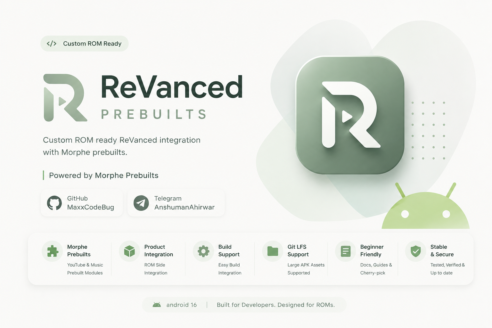

<p align="center">
  
</p>
<div align="center"> <h1> ReVanced Prebuilts</h1>

<h2> Maintained by MaxxCodeBug</h2>

<h3>by Anshuman X</h3>

<p><b>Custom ROM ready ReVanced integration with Morphe prebuilts.</b></p>

<p><b>Powered by Morphe Prebuilts</b></p>

[](https://github.com/maxxcodebug)

[](https://t.me/AnshumanAhirwar)

</div>---

# 🔥 Overview

This repository provides a complete ROM-side ReVanced integration solution for Android custom ROM developers.

The goal of this project is to simplify ReVanced integration and eliminate the need for manually generating, extracting, patching, and placing APKs during every build cycle.

# 📦 Included Features

- Morphe YouTube Prebuilt
- Morphe YouTube Music Prebuilt
- Product integration files
- Vendor configuration files
- Build integration support
- Git LFS support for large APK assets
- Beginner-friendly documentation

---

## 🆕 Latest Updates

June 2026

- ✅ Added Morphe YouTube prebuilt
- ✅ Added Morphe YouTube Music prebuilt
- ✅ Migrated large APK assets to Git LFS
- ✅ Reworked repository structure
- ✅ Improved documentation
- ✅ Added beginner cherry-pick guide
- ✅ Added conflict resolution guide
- ✅ Updated repository branding

## 🚧 Future Plans

- Regular Morphe APK updates
- Support group integration
- Additional ROM-side improvements
- Improved automation workflow

---

## 📦 Repository Setup
```bash
git clone https://github.com/maxxcodebug/vendor_revanced_new vendor/revanced
```
---

# #⚙️ Product Integration

Add the following line inside your device tree, vendor tree or product makefile:
```bash
$(call inherit-product, vendor/revanced/products/revanced.mk)
```
After inheriting the product configuration, applications will automatically be included during build.

---

## 🛠 Required Source Patches

### Frameworks Base Patch

##### Purpose

- Prevent Play Store auto-updates
- Improve ROM-side integration support

Apply
```bash
cd frameworks/base

git fetch https://github.com/PixelLineage/frameworks_base bc71449a25b6b0d16d2b4e611cdc9939bd89bb54

git cherry-pick FETCH_HEAD
``` 
Reference:

https://github.com/PixelLineage/frameworks_base/commit/bc71449a25b6b0d16d2b4e611cdc9939bd89bb54

---

##### Settings Patch

Purpose

- Allow enabling/disabling ROM-side ReVanced apps from Settings

Apply
```bash
cd packages/apps/Settings

git fetch https://github.com/PixelLineage/packages_apps_Settings 257d913938fbc2b590f8d030a00dd7131f38693d

git cherry-pick FETCH_HEAD
```
Reference:

https://github.com/PixelLineage/packages_apps_Settings/commit/257d913938fbc2b590f8d030a00dd7131f38693d

---

# 📚 Cherry-Pick Guide For Beginners

###### Step 1
```bash
cd path/to/project
```
###### Step 2
```bash
git fetch <repository-url> <commit-id>
```
Example:

git fetch https://github.com/PixelLineage/frameworks_base bc71449a25b6b0d16d2b4e611cdc9939bd89bb54

###### Step 3
```bash
git cherry-pick FETCH_HEAD
```
---

### 🚨 Handling Cherry-Pick Conflicts

Example:

CONFLICT (content): Merge conflict in some/file/path

Check:

git status

Conflict markers:
```bash
<<<<<<< HEAD
<Current source code>
=======
<Incoming patch code>
>>>>>>> COMMIT
```
###### Explanation

- HEAD = Your ROM source
- Incoming Patch = Cherry-picked changes

After resolving:
```bash
git add .
git cherry-pick --continue
```
Abort:
```bash
git cherry-pick --abort
```
Verify:
```bash
git status
```
Expected:

nothing to commit, working tree clean

---

## 📱 Included Applications

- Morphe YouTube
- Morphe YouTube Music

Applications may be updated whenever new releases become available.

---

# 🔨 Build

mka bacon

or use your ROM's normal build procedure.

---

#### 📦 Git LFS

Install:
```bash
git lfs install
```
Clone:
```bash
git clone https://github.com/maxxcodebug/vendor_revanced_new vendor/revanced
```
Git LFS assets will download automatically.

---

# 💬 Contact

Need help?

### Telegram

https://t.me/AnshumanAhirwar

Feel free to send a DM regarding:

- Integration issues
- Build errors
- Patch conflicts
- Repository suggestions

Support group coming soon.

---

# 👨‍💻 Maintainer

MaxxCodeBug

by Anshuman X

###### GitHub:

https://github.com/maxxcodebug

###### Telegram:

https://t.me/AnshumanAhirwar

---

## ❤️ Special Thanks

Morphe Team

[](https://github.com/MorpheApp)

This repository heavily relies on Morphe prebuilts.

Huge thanks to the Morphe Team for their continuous work, maintenance and contributions to the Android modding community.

---

# 🙌 Credits

- Morphe Team
- ReVanced Team
- j-hc
- PixelLineage Project
- Android Open Source Community
- All ROM Developers contributing to ReVanced integration

---

# 📜 Changelog

This repository is actively maintained.

Future commits may include:

- APK updates
- Documentation improvements
- Integration enhancements
- New features
- Bug fixes

Stay tuned for updates.

---

<div align="center">🚀 Enjoy Building 🚀

</div>
